# Vouchrs CI/CD Pipeline

**📖 The definitive guide to Vouchrs automated CI/CD pipeline**

This document provides comprehensive CI/CD documentation including GitHub Actions configuration, Docker registry setup, conventional commit automation, and workflow details.

## 🎯 Overview

Vouchrs employs an enterprise-grade CI/CD pipeline featuring:

- **🔄 Development workflow** with instant Docker builds on `dev` branch
- **🚀 Automatic releases** from conventional commits on `main` branch
- **📝 Semantic versioning** with automatic `Cargo.toml` updates
- **📋 Changelog generation** from conventional commits only
- **🐳 Multi-platform Docker images** published to GitHub Container Registry (GHCR)
- **🛡️ Security attestations** and vulnerability scanning
- **🤖 Dependency management** with Dependabot automation
- **🏷️ Intelligent tagging strategy** for all environments

## 📁 Configuration Files & Structure

### GitHub Actions Workflows (`.github/workflows/`)

| File | Purpose | Triggers |
|------|---------|----------|
| **`ci.yml`** | Continuous Integration & Dev Builds | Push to `dev`, PRs to `main` |
| **`main-release.yml`** | Automatic production releases | PR merges to `main`, manual dispatch |
| **`create-release.yml`** | Manual release override | Manual dispatch only |
| **`changelog.yml`** | Changelog updates | Release published, manual dispatch |
| **`dependabot.yml`** | Dependabot auto-merge | Dependabot PRs |

### Additional Configuration Files

| File | Purpose | Location |
|------|---------|----------|
| **`.github/dependabot.yml`** | Dependabot configuration | Repository root |
| **`cliff.toml`** | Git-cliff changelog configuration | Repository root |
| **`scripts/create-release.sh`** | Local release creation | Scripts directory |
| **`docs/CONVENTIONAL_COMMITS.md`** | Commit format guide | Documentation |

## 🚀 Core Features

### 🐳 Docker Container Registry
- **Registry**: `ghcr.io/vouchrs/vouchrs`
- **Multi-platform builds**: linux/amd64 and linux/arm64
- **Distroless base images**: Minimal attack surface
- **Smart tagging strategy**: Automatic versioning based on git refs
- **Security**: Build attestations and signed provenance tracking
- **Performance**: GitHub Actions caching for faster builds

### 🤖 Automated Dependency Management
- **Dependabot integration**: Rust, GitHub Actions, and Docker dependencies
- **Auto-merge capability**: Patch and minor updates
- **Security updates**: Automatic vulnerability patching
- **Weekly schedule**: Regular dependency maintenance

### 🏷️ Complete Tagging Strategy

| Git Reference | Dev Images | Production Images |
|---------------|------------|-------------------|
| `dev` branch | `dev`, `dev-{sha}` | - |
| PR merges to `main` | - | (Only if conventional commits detected) |
| `v1.2.3` tag | - | `latest`, `1.2.3`, `1.2`, `1` |
| `v1.0.0-beta.1` | - | `1.0.0-beta.1` (no `latest`) |
| PR branches | Build verification only | - |
| Manual dispatch | Custom tag specified | Custom tag specified |

## 🛠️ Usage Examples

### 🐳 Pulling Docker Images

```bash
# Development Images
docker pull ghcr.io/vouchrs/vouchrs:dev          # Latest dev build
docker pull ghcr.io/vouchrs/vouchrs:dev-abc1234  # Specific dev commit

# Production Images
docker pull ghcr.io/vouchrs/vouchrs:latest       # Latest stable release
docker pull ghcr.io/vouchrs/vouchrs:1.2.3        # Specific version
docker pull ghcr.io/vouchrs/vouchrs:1.2          # Minor version series
docker pull ghcr.io/vouchrs/vouchrs:1            # Major version series

# Pre-release Images
docker pull ghcr.io/vouchrs/vouchrs:1.0.0-beta.1 # Beta release
```

### 🚀 Manual Workflow Triggers

#### CI Workflow
1. Go to **Actions** tab in GitHub
2. Select **"CI/CD"**
3. Click **"Run workflow"**
4. Select the branch to build

#### Manual Release Workflow
1. Go to **Actions** tab in GitHub
2. Select **"Create Release"**
3. Click **"Run workflow"**
4. Enter version (e.g., `1.0.0`)
5. Mark as pre-release if needed

### 📋 Conventional Commit Examples

```bash
# Conventional commits format
git commit -m "feat(auth): add Apple Sign-In support"
git commit -m "fix(oauth): resolve token refresh issue"
git commit -m "docs: update deployment documentation"
git commit -m "feat!: change session storage format"
```

## 🔄 CI/CD Flow

### Development Workflow

```mermaid
graph LR
    A[Feature Branch] --> B[PR to dev]
    B --> C[Merge to dev]
    C --> D[🐳 Dev Docker Build]
    D --> E[PR to main]
    E --> F[PR Merge to main]
    F --> G[🔍 Detect Commits]
    G --> H[📦 Auto Release]
    H --> I[🐳 Production Images]
```



### 1. Feature Development
```bash
# Create feature branch
git checkout -b feat/apple-signin

# Use conventional commits
git commit -m "feat(auth): add Apple Sign-In support"

# Push and create PR to dev
git push origin feat/apple-signin
# → Triggers CI tests and Docker build verification
```

### 2. Dev Branch Integration
```bash
# Create PR to dev and merge via GitHub UI
# → Automatically builds and pushes:
#   - ghcr.io/vouchrs/vouchrs:dev
#   - ghcr.io/vouchrs/vouchrs:dev-{sha}
```

### 3. Production Release via PR
```bash
# Create PR from dev to main via GitHub UI
# → Triggers full CI test suite and Docker build verification

# Merge PR to main via GitHub UI
# → Automatically:
#   1. Analyzes conventional commits since last tag
#   2. Determines semantic version bump
#   3. Updates Cargo.toml version (0.1.0 → 0.2.0)
#   4. Generates CHANGELOG.md
#   5. Creates git tag (v0.2.0)
#   6. Creates GitHub release
#   7. Builds production Docker images
```

**🔒 Security Note**: Direct pushes to `main` are not allowed. All changes must go through Pull Request review process.
git push origin dev
# → Automatically builds and pushes:
#   - ghcr.io/vouchrs/vouchrs:dev
#   - ghcr.io/vouchrs/vouchrs:dev-{sha}
```

### 3. Production Release
```bash
# Create PR from dev to main via GitHub UI
# → Triggers full CI test suite

# Merge PR to main via GitHub UI
# → Automatically:
#   1. Analyzes conventional commits since last tag
#   2. Determines semantic version bump
#   3. Updates Cargo.toml version (0.1.0 → 0.2.0)
#   4. Generates CHANGELOG.md
#   5. Creates git tag (v0.2.0)
#   6. Creates GitHub release
#   7. Builds production Docker images
```

## 🐳 Docker Image Strategy

### Registry
All images are published to: `ghcr.io/vouchrs/vouchrs`

### Development Images
```bash
# Latest dev build
docker pull ghcr.io/vouchrs/vouchrs:dev

# Specific dev commit
docker pull ghcr.io/vouchrs/vouchrs:dev-abc1234
```

### Production Images
```bash
# Latest stable release
docker pull ghcr.io/vouchrs/vouchrs:latest

# Specific version
docker pull ghcr.io/vouchrs/vouchrs:1.2.3

# Semantic versioning
docker pull ghcr.io/vouchrs/vouchrs:1     # Major version
docker pull ghcr.io/vouchrs/vouchrs:1.2   # Minor version
```

### Image Features
- **Multi-platform**: linux/amd64, linux/arm64
- **Distroless base**: Minimal attack surface
- **Static linking**: No runtime dependencies
- **Build attestations**: Signed security provenance
- **Layer caching**: Fast GitHub Actions builds

## 📋 Conventional Commits

### Format
```
<type>[optional scope]: <description>

[optional body]

[optional footer(s)]
```

### Commit Types & Version Impact

| Type | Version Bump | Description | Example |
|------|--------------|-------------|---------|
| `feat:` | **Minor** (0.1.0 → 0.2.0) | New features | `feat(auth): add Apple Sign-In` |
| `fix:` | **Patch** (0.1.0 → 0.1.1) | Bug fixes | `fix(oauth): handle token refresh` |
| `feat!:` | **Major** (0.1.0 → 1.0.0) | Breaking changes | `feat!: change session format` |
| `docs:` | **Patch** (0.1.0 → 0.1.1) | Documentation | `docs: update API guide` |
| `style:` | **Patch** (0.1.0 → 0.1.1) | Code style | `style: format with rustfmt` |
| `refactor:` | **Patch** (0.1.0 → 0.1.1) | Code refactoring | `refactor(proxy): extract logic` |
| `test:` | **Patch** (0.1.0 → 0.1.1) | Tests | `test: add OAuth flow tests` |
| `chore:` | **Patch** (0.1.0 → 0.1.1) | Maintenance | `chore: update dependencies` |

### Breaking Changes
```bash
# Using ! suffix
feat!: change session storage format
fix(auth)!: require API key for all endpoints

# Using footer
feat(auth): add new authentication method

BREAKING CHANGE: Sessions now require user context
```

### Helper Tools
```bash
# Local changelog preview
git cliff --unreleased

# Full changelog generation
git cliff
```

## 🚀 Release Process

### Automatic Releases (Primary Method)

1. **Write conventional commits** during development
2. **Merge PR to `main`** branch
3. **Pipeline automatically**:
   - Detects commit types since last tag
   - Calculates semantic version bump
   - Updates `Cargo.toml` version
   - Generates `CHANGELOG.md` from commits
   - Creates annotated git tag
   - Publishes GitHub release
   - Builds multi-platform Docker images
   - Updates release notes with Docker instructions

### Manual Releases (Fallback)

1. Go to **Actions** → **Create Release**
2. Click **Run workflow**
3. Enter version (e.g., `1.0.0`)
4. Mark as pre-release if needed
5. Pipeline handles the rest

### Local Release Script
```bash
# Interactive local release creation
./scripts/create-release.sh
```

## 🏷️ Tagging Strategy

| Git Event | Docker Tags Generated |
|-----------|----------------------|
| Push to `dev` | `dev`, `dev-{sha}` |
| PR merge to `main` | (No tags, only if conventional commits detected) |
| Release `v1.2.3` | `latest`, `1.2.3`, `1.2`, `1` |
| Pre-release `v1.0.0-beta.1` | `1.0.0-beta.1` (no `latest`) |

## 🔧 Workflow Details

### CI/CD Pipeline (`ci.yml`)
**Triggers**: Push to `dev`, PRs to `main`

**Jobs**:
- ✅ **Test**: Formatting (`cargo fmt`), linting (`cargo clippy`), unit tests
- 🔒 **Security Audit**: Vulnerability scanning (`cargo audit`)
- 🐳 **Docker Build Dev**: Builds and pushes dev images (dev branch only)
- 🧪 **Docker Build Test**: Build verification (PRs)

### Main Release Pipeline (`main-release.yml`)
**Triggers**: PR merges to `main`, manual dispatch

**Features**:
- 🔍 Conventional commit analysis
- 📊 Semantic version calculation
- 📝 Automatic `Cargo.toml` updates
- 📖 Changelog generation
- 🏷️ Git tag creation
- 📦 GitHub release publishing
- 🐳 Production Docker builds
- 🔐 Security attestations

### Manual Release Pipeline (`create-release.yml`)
**Triggers**: Manual workflow dispatch

**Use Cases**:
- Emergency releases
- Custom version numbers
- Pre-release versions
- When automatic detection fails

### Changelog Pipeline (`changelog.yml`)
**Triggers**: Release published, manual dispatch

**Features**:
- Updates `CHANGELOG.md` from conventional commits
- Extracts release notes for GitHub releases
- Supports unreleased changelog generation

## 🛡️ Security Features

- ✅ **Distroless images**: Minimal attack surface
- ✅ **Non-root execution**: Security best practices
- ✅ **Static binaries**: No runtime dependencies
- ✅ **Build attestations**: Signed provenance tracking
- ✅ **Vulnerability scanning**: Regular dependency audits
- ✅ **Container scanning**: Automated security checks

## 📊 Monitoring & Troubleshooting

### Build Status
- **Actions tab**: View all workflow runs
- **Packages tab**: Monitor Docker images
- **Releases tab**: Track version history

### Common Issues

**No release created from main merge:**
- Check if commits are conventional format
- Verify commits exist since last tag
- Review workflow logs in Actions tab

**Docker build failures:**
- Check GitHub Actions cache
- Verify multi-platform build support
- Review Docker build logs

**Version mismatch:**
- Ensure `cargo set-version` worked correctly
- Check if `Cargo.lock` was updated
- Verify git tag matches release version

### Manual Debugging
```bash
# Test conventional commit detection
git cliff --unreleased

# Check what would be released
git log $(git describe --tags --abbrev=0)..HEAD --oneline

# Verify Docker build locally
docker build -f docker/Dockerfile .
```

## 🎯 Best Practices

### Commit Guidelines
- Use conventional commit format consistently
- Include scope for larger features: `feat(auth): add SAML support`
- Write clear, descriptive commit messages
- Use breaking change syntax for API changes

### Branch Strategy
- **Feature branches**: `feat/feature-name`, `fix/bug-name`
- **Dev branch**: Integration and testing
- **Main branch**: Production releases only
- **Protected branches**: Require CI checks and reviews

### Release Strategy
- **Patch releases**: Bug fixes, docs, minor improvements
- **Minor releases**: New features, backwards compatible
- **Major releases**: Breaking changes, API modifications
- **Pre-releases**: Beta versions, release candidates

## 🔧 Setup Requirements & Next Steps

### ✅ Current Configuration Status

- [x] **GitHub Packages (GHCR)** - Enabled and configured
- [x] **GITHUB_TOKEN permissions** - Automatically configured
- [x] **Multi-platform Docker builds** - linux/amd64 and linux/arm64
- [x] **Dependabot integration** - Rust, GitHub Actions, and Docker dependencies
- [x] **Security attestations** - Build provenance and vulnerability scanning
- [x] **Conventional commit automation** - Git-cliff and semantic versioning

### 📋 Recommended Repository Setup

#### Branch Protection Rules
Configure in **Settings** → **Branches** → **Add rule** for `main`:
- ✅ Require status checks to pass before merging
- ✅ Require branches to be up to date before merging
- ✅ Require pull request reviews before merging
- ✅ Restrict pushes that create files larger than 100MB

#### Required Status Checks
Enable these checks for protected branches:
- `test` (Cargo tests)
- `lint` (Clippy + rustfmt)
- `security-audit` (Cargo audit)
- `docker-build-test` (Docker verification)

#### Team Configuration
For Dependabot auto-merge:
- Create `maintainers` team OR
- Update `.github/dependabot.yml` with actual usernames

### 🚀 Optional Enhancements

#### Security & Monitoring
- [ ] **CodeQL Analysis** - Add GitHub's security scanning
- [ ] **Container Vulnerability Scanning** - Trivy or Snyk integration
- [ ] **SARIF Upload** - Security findings integration
- [ ] **Slack/Discord Notifications** - Build status alerts

#### Performance & Quality
- [ ] **Benchmark Workflows** - Performance regression detection
- [ ] **Code Coverage Reporting** - Codecov or Coveralls integration
- [ ] **Dependency License Scanning** - License compliance checks
- [ ] **SonarQube Integration** - Code quality metrics

#### Advanced CI/CD
- [ ] **Staging Environment** - Automatic deployment to staging
- [ ] **Blue-Green Deployments** - Zero-downtime production updates
- [ ] **Canary Releases** - Gradual production rollouts
- [ ] **Multi-environment Config** - Dev/Staging/Prod configurations

### 🛡️ Security Best Practices

#### Repository Security
- Enable **Dependency graph** in repository settings
- Enable **Dependabot alerts** for vulnerability notifications
- Configure **Branch protection rules** to prevent direct pushes to main
- Use **Environment protection rules** for production deployments

#### Secrets Management
- Store sensitive data in **GitHub Secrets** (not hardcoded)
- Use **Environment secrets** for environment-specific values
- Rotate **Personal Access Tokens** regularly
- Implement **least privilege access** for service accounts

### 📊 Monitoring & Maintenance

#### Regular Tasks
- **Weekly**: Review Dependabot PRs and merge approved updates
- **Monthly**: Check for new GitHub Actions versions
- **Quarterly**: Audit repository permissions and access
- **Annually**: Review and update security policies

#### Key Metrics to Monitor
- **Build success rate** - Target: >95%
- **Build duration** - Target: <10 minutes
- **Security vulnerabilities** - Target: 0 high/critical
- **Test coverage** - Target: >80%

## 🎯 Implementation Summary

### ✅ What's Been Implemented

Your Vouchrs project now features a comprehensive CI/CD pipeline that handles:

#### Development Workflow
- **Every push to `dev`** → Builds and pushes Docker images with `dev` and `dev-{sha}` tags
- **Pull requests** → Runs full CI tests and Docker build verification
- **Available at**: `ghcr.io/vouchrs/vouchrs:dev`

#### Production Automation
- **Merges to `main`** → Automatically detects conventional commits and creates releases
- **Semantic versioning** → Analyzes commits to determine major/minor/patch bumps
- **Automatic changelog** → Generated from conventional commits only
- **Version synchronization** → `Cargo.toml` version matches git tag
- **Production Docker images** → Built with `latest`, versioned, and semantic tags

#### Manual Override Capabilities
- **Workflow dispatch** → Manual releases when automatic detection isn't suitable
- **Pre-release support** → Mark releases as pre-release when needed
- **Custom versioning** → Override automatic version detection

### 📁 Files Created/Modified

#### New GitHub Actions Workflows
- `.github/workflows/main-release.yml` - Automatic releases from main branch
- `.github/workflows/create-release.yml` - Manual release workflow override
- `.github/workflows/changelog.yml` - Standalone changelog generation

#### Enhanced Existing Workflows
- `.github/workflows/ci.yml` - Added dev branch Docker builds and enhanced testing

#### Documentation & Helper Tools
- `.github/workflows/README.md` - This comprehensive guide
- `docs/CONVENTIONAL_COMMITS.md` - Detailed conventional commits guide
- `scripts/create-release.sh` - Local release creation script

#### Configuration Files
- `cliff.toml` - Git-cliff configuration for changelog generation (existing, verified)
- `.github/dependabot.yml` - Dependabot configuration for dependency updates

### 🚀 Getting Started Today

#### 1. Start Using Conventional Commits
```bash
# Follow the conventional commits format
git commit -m "feat(auth): add new OAuth provider support"
git commit -m "fix(session): resolve memory leak issue"
git commit -m "docs: update deployment guide"
```

#### 2. Development Workflow
```bash
# 1. Create feature branch
git checkout -b feat/new-feature

# 2. Make changes with conventional commits
git commit -m "feat(auth): implement feature X"

# 3. Push to dev (triggers dev Docker build)
git checkout dev
git merge feat/new-feature
git push origin dev

# 4. Create PR to main
# 5. Merge to main (triggers automatic release)
```

#### 3. Manual Release (when needed)
- Go to **Actions** → **Create Release** → **Run workflow**
- Enter version (e.g., `1.0.0`)
- Choose pre-release if needed

### 🎉 Result

Your Vouchrs project now has enterprise-grade CI/CD with automatic versioning, security scanning, and multi-platform Docker distribution! 🚀

**Next Steps**: Start using conventional commits and watch your releases automate themselves!
